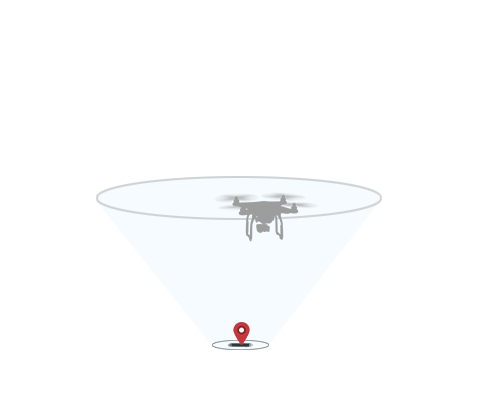

# DJI Mobile SDK Framework Guide

## Purpose of Handbook 

This handbook provides a high level overview of the different components that make up the SDK, so that developers can get a feel for the SDK's structure and its different components. This handbook does not aim to provide specific information that can be found in the SDK. After reading through this handbook, developers should be able to begin working closely with the SDK.

## SDK Structure

### Camera

#### 1. SD Card

DJI drones will save photos and videos captured through the camera to the SD card inserted into the camera. Information about the current state of the SD card can be accessed through the camera interface.

#### 2. Playback 

Accessing the media files in the SD card require that you switch the camera into a playback mode. There are several different playback modes, each allowing you to view or manipulate the files differently. The camera interface allows you to switch between playback modes, and carry out actions specific to each mode.

#### 3. System State

The system state of the camera is monitored through a set of bool values. Is the camera overheating? Is the camera connected to a PC? Is it currently taking a single photo, or continuous photos? The answers to these and similar questions are found in the camera interface.

#### 4. Settings

The DJI drones' cameras have a large number of settings to adjust (i.e. shutter speed, ISO, aperture). The camera interface allows you to adjust these settings.

### Battery

#### 1. Smart Battery

The DJI battery interface includes a set of Smart Battery functions, which can be used to ensure that the drone has enough battery left to return home.
 
### Gimbal

The gimbal is the mechanism that keeps the camera steady while the drone moves, absorbing shock from vibrations and sudden movements. The gimbal is also responsible for controlling the direction that the camera is pointing in. The gimbal interface allows you to control and get information about the gimbal.
	
### Main Controller

The main controller can be used to provide fundamental information about the drone, as well as control core functionality.

#### 1. System State

The main controller's system state gives crucial information about the current state of the drone, which will allow you to determine its velocity, location, as well as when and where to appropriately land the drone.

#### 2. Return To Home

DJI drones contain a 'Return To Home' functionality, which automatically directs the drone back to home, which is traditionally the point from where the drone has taken off. If the GPS signal is not good, the home point will be recorded when the GPS signal is strong enough. The main controller includes functions for configuring and using 'Return To Home'.

### Intelligent Navigation 

Intelligent Navigation provides the ability for developers to control the drone through the use of missions. Each type of mission is designed to navigate the drone in some specific and particular manner, such as following an object or orbiting a fixed point. More information of each type of navigation mission is given in the Concepts to Understand section below.

**Note for Android Developers: There currently does not exist a Navigation package in the Android SDK. Missions can be found in the GroundStation package instead.**

### Range Extender

The Range Extender is a wireless communication device that operates within the 2.4 GHz frequency band and is used for extending the effective range of communication between a mobile device (Smartphone) and the Phantom 2 series.

### Image Transmitter

The Image Transmitter is a physical component found in the remote controllers of the Inspire 1 and Phantom 3 series, used to transmit high quality photo and video files. Older drone models require the purchase of a Light Bridge unit to achieve the same capabilities.

### Remote Controller

Controls the interaction between the Remote Controller and the drone.

#### 1. Slave, Master

Remote controllers of the Inspire 1 can be configured to act as a Master or a Slave. Masters control the entire drone, including the gimbal, while Slaves control only the gimbal. Slaves can only issue commands via a Master.

### DJIMedia

A class used to store information about an individual media file in the drone's SD card. It's used with the Phantom 2 series, Phantom 3 Professional, Phantom 3 Advanced and Inspire 1.

## Concepts to Understand 

### Attitude

Attitude is a vehicle's orientation about its center of mass. You can accurately describe an object's attitude through three characteristics: its pitch, roll and yaw. Controlling both the drone and the gimbal's orientation through the SDK requires that you manipulate these three values:

#### 1. Yaw

The above diagram shows the drone from above. Yaw measures an object's rotation about the vertical axis. Adjusting the yaw will keep the drone horizontal, but change the direction it is facing.

#### 2. Pitch

The above diagram shows the drone from the side. Pitch measures an object's rotation about the lateral axis. Adjusting the pitch will tilt the drone forwards or backwards.

#### 3. Roll

The above diagram shows the drone from behind. Roll measures an object's rotation about the longitudinal axis. Adjusting the roll will tilt the drone left or right.

### Throttle

Throttle controls the drone's velocity in the direction of the vertical axis. While the drone is level, adjusting the throttle will move the drone up or down. However, changing the drone's pitch or roll will tilt its vertical axis, causing the throttle to accelerate the drone at an angle.

### Types of Navigation Missions

Navigation is the umbrella term used to refer to controlling the drone through one of a variety of Navigation Missions.

#### 1. Follow Me Mission

In a follow me mission, the drone is programmed to track and maintain a constant distant relative to some object, such as a person or a moving vehicle. (Inspire 1 is not supported)

#### 2. Hot Point Mission

In a hot point mission, the drone will repeatedly fly circles of a constant radius around a specified point called a Hot Point.

#### 3. IOC (Intelligent Orientation Control) Mission

IOC allows users to lock the orientation of aircraft in different fashions. In other words, the orientation of the drone is irrelevant to the direction it moves in. IOC only works under F mode, and user must toggle the flight mode switch to “F” mode on the RC to activate IOC. 

IOC has two main modes, **Course Lock** and **Home Lock**. 

**Course Lock** allows you to lock the orientation of the drone, while moving the drone relative to an external linear coordinate system.

**Home Lock** moves the drone relative to an external circular coordinate system, with the origin called the Home Point. This means that pushing forward on the remote will move the drone directly away from the Home Point, pushing back will move the drone directly towards it, and pushing left or right will move the drone in a circular path around it.

#### 4. Waypoint Mission

Waypoints are physical locations that the drone will fly to. Creating a series of waypoints, in effect, will program a flight route for the drone to follow. Actions can also be added to waypoints, which will be carried out when the drone reaches the waypoint.

### Joystick/Flight Control

Flight control is a direct, low level method of controlling the drone. Flight control allows you to direct the drone by adjusting its yaw, pitch, roll and throttle.

### Callbacks

#### 1. DJI Errors

Every SDK function you call requires a callback as a parameter, which will be carried out after the drone executes the given command(s). The most common callback takes in a DJIError returned from the drone, which gives simple feedback on the success of the function execution.

#### 2. Other Callbacks

It is appropriate for some functions in the SDK to receive more than a DJIError as feedback after the drone has finished execution. It may also be necessary for additional commands to be sent during different stages of execution. For example, the callback for downloading files from the SD card has methods to be carried out during the start, the end, and on during progress updates of the download process. Appropirately, it takes in an int **progress** as well as the expected DJIError object.

Some callbacks are also called regularly to monitor changes in the drone's state, such as a change in its current battery level.

## Unique Aircraft Capabilities 

### Phantom 2 Vision & Vision+

1. Phantom 2 Series require range extenders.
2. The Phantom 2 Series cameras can only adjust their pitch. Yaw and roll are non-adjustable.
3. The Phantom 2 Series has limited Intelligent Navigation (previously called Ground Station) support, capable of only waypoint missions.

### Phanton 3 Advanced & Professional

1. The Phantom 3 Professional supports up to 4K, 30fps video recording, while the Phantom 3 Advanced only supports up to 1080p, 30fps.

2. Supports channel selection and live stream settings, Max Transmission Distance: 2000m.

### Inspire 1

1. The Inspire 1 is unique in that it lifts its landing gears up out of the camera's field of vision during flight, allowing the camera to rotate along the horizontal plane in any direction without capturing the legs. As a result, the Inspire 1's gimbal has been designed to be able to rotate, from its initial front facing orientation, 320 degrees clockwise or anti-clockwise, giving it a 640 degree range of rotation.

2. The Inspire 1 remote controllers have master/slave functionality.

3. The Inspire 1 remote controllers have embedded GPS.
4. The Inspire 1 remote has HDMI output capabilities.

### Matrice 100

The Matrice 100 is the first of our fully flexible developer drones, with fully customizable hardware. The Matrice can be programmed using the Onboard SDK, which allows for direct control of the drone, without having to control it through an external mobile device. Find out more about the Onboard SDK [here](https://developer.dji.com/onboard-sdk/).

## Where to go from here?

You should now have a general familiarity of the different components of the SDK, and understand core air flight concepts. Your next step should be to jump in and start developing using the SDK! Good luck!
