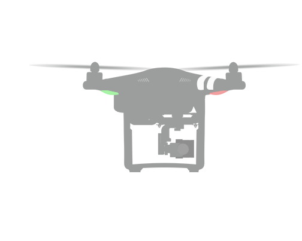
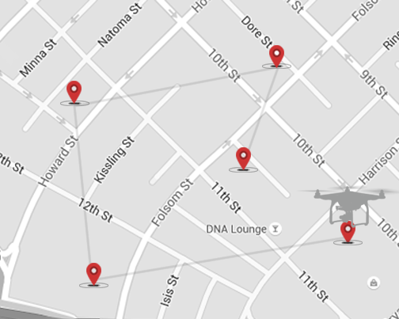

# DJI Mobile SDK Framework Handbook

<!-- toc -->

[English](#purpose-of-handbook) | [中文](#指南目的)

## Purpose of Handbook 

This handbook provides a high level overview of the different components that make up the SDK, so that developers can get a feel for the SDK's structure and its different components. This handbook does not aim to provide specific information that can be found in the SDK. After reading through this handbook, developers should be able to begin working closely with the SDK.

## SDK Structure

### Camera

#### 1. SD Card

DJI aircrafts will save photos and videos captured through the camera to the SD card inserted into the camera. Information about the current state of the SD card can be accessed through the camera interface.

#### 2. Playback State and Manager 

Accessing the media files in the SD card require that you switch the camera into a playback mode. There are several different playback modes, each allowing you to view or manipulate the files differently. The playback manager allows you to switch between playback modes, and carry out actions specific to each mode. Moreover, you can check the playback state like the numbersOfThumbnail, currentSelectedFileIndex, videoDuration, etc.

#### 3. System State

The system state of the camera is monitored through a set of bool values. Is the camera overheating? Is the camera in USB mode? Is it currently taking a single photo, or burst photos? The answers to these and similar questions are found in the camera interface.

#### 4. Camera Parameters

Camera has various parameter ranges for you to adjust (i.e. shutter speed range, ISO range, aperture range). The camera interface allows you to adjust these parameters.

#### 5. Camera Lens State

DJI X5 and X5R camera support adjusting camera lens feature. You can check if the lens is installed, the lens type, and focusMode etc from the camera lens state.

#### 6. Media and Media Manager

Media is a class used to store information about an individual media file in the aircraft's SD card. It can represent either a photo or video. There are various media types like JPEG, MP4, RAWDNG, etc. It contains necessary parameters such as fileName, time created and a thumbnail of the media. The Media Manager also provides functions for you to fetch or delete media.
 
### Gimbal

The gimbal is the component that keeps the camera steady while the aircraft moves, compensating for movements from vibrations and sudden shocks. The gimbal is also responsible for controlling the direction the camera is pointing in. The gimbal interface allows you to control and get information about the gimbal.

### Battery

The DJI battery interface includes a set of Smart Battery functions, which can be used to get battery state, warning info and self discharge day. It can ensure whether the battery is healthy to use for flying.

### AirLink

AirLink represents the wireless communication either between the remote controller and aircraft, or for WiFi products like Phantom 3 Standard and OSMO, the link between the WiFi product and the mobile device.

#### 1. Light Bridge Link

  This is used for DJI Light Bridge 2. It provides a set of functions, which can be used to get and set channel, data transfer rate, FPV video quality latency, FPV video band width, etc. Also, you can set video output format like HDMI, SDI and even set PIP(Picture In Picture) position on the screen. Furthermore, it contains delegate methods to get RC signal info, signal strength, video data, etc.

#### 2. WiFi Link

 This is used for WiFi products like DJI Phantom 3 Standard and OSMO. It provides a set of functions, which can be used to get and set WiFi SSID, password, frequency band. Also you can reboot the WiFi and update the WiFi signal quality too.

### Handheld Controller

The handheld controller can be used to control core functionality of DJI Handheld devices, especially for OSMO. You can modify OSMO's mode like sleep mode, awake mode and even shut down the device.

### Flight Controller

The flight controller can be used to provide fundamental information about the aircraft, as well as control core functionality.

#### 1. Current State

The flight controller's current state gives crucial information about the current state data of aircraft, which will allow you to determine its velocity, location, satellite count, remaining battery state, as well as the no fly zone status.

#### 2. Return To Home

DJI aircrafts contain a 'Return To Home' functionality, which automatically directs the aircraft back to home (normally the point from where the aircraft has taken off). If the GPS signal is not good, the home point will be recorded when the GPS signal is strong enough. The flight controller includes functions for configuring and using 'Return To Home'.

#### 3. Virtual Stick

The flight controller provides the virtual stick control feature for you to control the aircraft's attitude. You can control the aircraft's yaw, pitch, roll attitude and vertical throttle by sending specific flight control data.

#### 4. IMU

IMU is short for Inerial Measurement Unit, it contains two important sensors like Gyroscope and Accelerator. The flight controller provides features for you to access the status of sensors. Also it allow you to calibrate the IMU and check the calibration status too. Currently, DJI Phantom 3 Series and Inspire 1 Series aircrafts has 1 IMU module, Matrice 100 has 1 IMU module and for Phantom 4, it has 2 IMU modules.

### Mission Manager

Mission manager provides the ability for developers to control the aircraft through the use of missions. Each type of mission is designed to navigate the aircraft in some specific and particular manner, such as following an object or orbiting a fixed point. More information of each type of navigation mission is given in the Concepts to Understand section below.

### Remote Controller

Controls the interaction between the Remote Controller and the aircraft.

#### 1. Slave, Master

Remote controllers of the Inspire 1 can be configured to act as a Master or a Slave. Masters control the entire aircraft, including the gimbal, while Slaves control only the gimbal. Slaves can only issue commands via a Master.

#### 2. Sport Mode

Sport Mode is only supported by Phantom 4. It helps you to achieve best-in-class flight control. Combined with its magnesium core designed for increased agility, it brings you the ultimate thrill of speed. Maximum speed is increased by 25% while all positioning systems are kept on for a safer, better controlled flight.

## Concepts to Understand 

### Attitude

Attitude is a vehicle's orientation about its center of mass. You can accurately describe an object's attitude through three characteristics: its pitch, roll and yaw. Controlling both the aircraft and the gimbal's orientation through the SDK requires that you manipulate these three values:

#### 1. Yaw

The above diagram shows the aircraft from above. Yaw measures an object's rotation about the vertical axis. Adjusting the yaw will keep the aircraft horizontal, but change the direction it is facing.

#### 2. Pitch

The above diagram shows the aircraft from the side. Pitch measures an object's rotation about the lateral axis. Adjusting the pitch will tilt the aircraft forwards or backwards.

#### 3. Roll

The above diagram shows the aircraft from the front. Roll measures an object's rotation about the longitudinal axis. Adjusting the roll will tilt the aircraft left or right.

### Throttle

Throttle controls the aircraft's velocity in the direction of the vertical axis. While the aircraft is level, adjusting the throttle will move the aircraft up or down. However, changing the aircraft's pitch or roll will tilt its vertical axis, causing the throttle to accelerate the aircraft at an angle.

#### IOC (Intelligent Orientation Control)

IOC allows users to lock the orientation of aircraft in different fashions. In other words, the orientation of the aircraft is irrelevant to the direction it moves in. IOC only works under F mode, and the user must toggle the flight mode switch to “F” mode on the RC to activate IOC. 

IOC has two main modes, **Course Lock** and **Home Lock**. 

**Course Lock** allows you to lock the orientation of the aircraft, while moving the aircraft relative to an external linear coordinate system.

**Home Lock** moves the aircraft relative to an external circular coordinate system, with the origin called the Home Point. This means that pushing forward on the remote will move the aircraft directly away from the Home Point, pushing back will move the aircraft directly towards it, and pushing left or right will move the aircraft in a circular path around it.

### Types of Intelligent Navigation

Intelligent Navigation is the umbrella term used to refer to controlling the aircraft through one of a variety of Missions.

#### 1. Follow Me Mission

In a follow me mission, the aircraft is programmed to track and maintain a constant distant relative to some object, such as a person or a moving vehicle.

#### 2. Hot Point Mission

In a hot point mission, the aircraft will repeatedly fly circles of a constant radius around a specified point called a Hot Point.

#### 3. Waypoint Mission

Waypoints are physical locations that the aircraft will fly to. Creating a series of waypoints, in effect, will program a flight route for the aircraft to follow. Actions can also be added to waypoints, which will be carried out when the aircraft reaches the waypoint.

#### 4. Custom Mission（Beta Version）

In a custom mission, you can create multiple kinds of mission steps to control the aircraft to execute a series of complex tasks. Mission steps will be stored in a queue to execute, there is no limit to the number of mission steps in each custom mission. By using Custom Mission, you can achieve your desired functionality easier and more efficiently.

Currently, the mission step types are limited, like Waypoint Step, Takeoff Step, ShootPhoto Step, etc. 

#### 5. Panorama Mission

Panorama Mission is only supported on OSMO. During the Panorama Mission, commands are not allowed to be sent to the camera until the mission is finished. Panorama Mission doesn't support the image stitching feature, so the images need to be stitched manually. All the images will be stored on the SD card. 

#### 6. TapFly Mission

TapFly Mission is only supported on Phantom 4. Given a coordinate in the live video stream (which can come from a user tap), the aircraft will calculate and fly toward the coordinate's direction in the real wold. During flight, the aircraft will automatically detect and avoid obstacles.

During the mission, you can use the remote controller's yaw stick to adjust the heading of the aircraft, which also adjusts the direction of flight to the new yaw. Using any other stick controls will cancel the mission.

#### 7. ActiveTrack Mission

ActiveTrack Mission is only supported on Phantom 4. It allows an aircraft to track a moving subject using the vision system and without a GPS tracker on the subject.

The main camera is used to track the target, so the gimbal cannot be adjusted during an ActiveTrack mission. During the mission the aircraft can be manually flown with pitch, roll and throttle to move around the subject being tracked.

### Joystick/Flight Control

Flight control is a direct, low level method of controlling the aircraft. Flight control allows you to direct the aircraft by adjusting its yaw, pitch, roll and throttle.

### DJI Completion Blocks

Every SDK function you call requires a completion block as a parameter, which will be carried out after the aircraft executes the given command(s) or finish the related actions. For some special actions (Like take off, retract landing gear), which will take a peroid of time to finish, the completion block will be called once the actions finish.

## Unique DJI Product Capabilities 

### Phantom 4

**1.** The Phantom 4 supports **TapFly** and **ActiveTrack** missions, which brings a more autonomous flying experience.

**2.** The Phantom 4 has a new **Sport Mode**, providing best-in-class flight control at speeds 25% faster than the Phantom 3.

**3.** The Phantom 4 has extended its flight time to 28 minutes flight time. This is a 25% improvement over the Phantom 3.

**4.** The Phantom 4 has 5 cameras. The 4K on-board camera, 2 cameras on the front, and 2 cameras on the bottom. Using these cameras, the Phantom 4 is able to create a 3D model of the world and use that data to navigate by itself, sensing obstacles and achieve collison avoidance.

### Phantom 3 Professional, Advanced & Standard

**1.** The Phantom 3 Professional supports up to 4K, 30fps video recording, while the Phantom 3 Advanced only supports up to 1080p, 30fps. Moreover, the Phantom 3 Standard supports up to 2.7K, 30fps video recording.

**2.** The Phantom 3 Professional and Advanced remote controller use USB to communicate with the mobile device, while the Phantom 3 Standard remote controller uses WiFi to communicate.

**3.** All support channel selection and live stream settings.

### Inspire 1

**1.** The Inspire 1 is unique in that it lifts its landing gears up out of the camera's field of vision during flight, allowing the camera to rotate along the horizontal plane in any direction without capturing the legs. As a result, the Inspire 1's gimbal has been designed to be able to rotate, from its initial front facing orientation, 320 degrees clockwise or anti-clockwise, giving it a 640 degree range of rotation.

**2.** The Inspire 1 remote controllers have master/slave functionality.

**3.** The Inspire 1 remote controllers have embedded GPS.

**4.** The Inspire 1 remote controller has HDMI output capabilities.

### Inspire 1 Pro

The Inspire 1 Pro is almost the same as the Inspire 1 except for the camera. It supports Zenmuse X5 and Zenmuse X5R camera. 

The Zenmuse X5 and X5R both can capture ultra-clear 4K video at up to 30 frames per second and capture photos at 16 megapixels in Adobe DNG RAW. The Zenmuse X5R is also the first camera of this type able to shoot 4K raw video. As M4/3 cameras, you have a choice of lenses and also full wireless control over focus, aperture and more.

### Matrice 100

The Matrice 100 is the first of our fully flexible developer aircrafts, with fully customizable hardware. The Matrice can be programmed using the Onboard SDK, which allows for direct control of the aircraft, without having to control it through an external mobile device. Find out more about the Onboard SDK [here](https://developer.dji.com/onboard-sdk/).

### OSMO

The OSMO combines the Zenmuse X3/X5 camera/gimbal with a detachable handle, bringing the benefits of stabilized 4K shooting to a handheld form factor. 

**1.** It uses WiFi to connect with your mobile devices.

**2.** The OSMO's gimbal has been designed to be able to rotate, from its initial front facing orientation, 320 degrees clockwise or anti-clockwise, giving it a 640 degree range of rotation. 

**3.** The OSMO supports Panorama mode, it makes shooting 360° panoramas easier than ever.

**4.** The OSMO supports Timelapse and Long Exposure mode.

**5.** The OSMO's integrated microphone allows onboard audio recording. You can also plug in your own microphone to record audio.

## Summary

You should now have a general familiarity of the different components of the SDK, and understand core flight concepts. Your next step should be to jump in and start developing using the SDK! Good luck!

---

## 指南目的

本指南针对SDK的各种抽象概念进行了解释，方便开发者对SDK的架构和各种概念有一个清晰的理解。本指南不会提供SDK的详细信息，具体您可以直接在SDK中了解。在阅读完本指南后，开发者可以更容易上手我们的SDK。

## SDK 架构

### 相机

#### 1. SD卡

DJI 飞行器会把拍摄到的照片和视频保存到相机的SD卡中，SD卡的当前状态信息可以在相机接口中获取。

#### 2. 回放状态和控制器

访问SD卡中的媒体文件需要你把相机切换到回放模式。相机有多种不同的回放模式，每一种模式都可以让你查看或者操作文件。回放控制器允许你切换不同的回放模式，并且调用针对特定模式的`action`方法。另外，你还可以查看当前的回放状态，如缩略图的数量，当前选中的文件序号，视频播放时间等。

#### 3. 系统状态

相机的系统状态通过使用一系列的布尔值记录状态。相机过热？相机是否连接到PC上面了？是否在进行单张拍照，或者定时拍？相关答案或者问题，你都可以在相机接口中找到。

#### 4. 相机参数

DJI 飞行器的相机有大量的参数可以去设置 (如快门速度，ISO，光圈)。相机接口允许你去设置这些参数。

#### 5. 相机镜头状态

DJI X5 和 X5R 相机支持调整相机镜头参数。你可以检查镜头是否安装正常，获取镜头的类型，以及光圈模式设置等操作。
 
#### 6. 媒体文件和媒体文件管理器

媒体文件类用来存放飞行器SD卡中的媒体文件信息。它可以代表照片或者视频。目前有多种媒体文件格式，如JPEG，MP4和RAWDNG等。它包含多个重要的参数，如文件名，创建时间和缩略图。另外，媒体文件管理器提供了获取和删除媒体文件列表的方法。

### 云台

云台是可以在飞行器移动，震动或者突然晃动的情况下，确保相机稳定的机械装置。云台还可用于控制相机的朝向。云台接口允许你去控制和获取云台的状态信息。

### 电池

DJI SDK的电池接口提供了访问智能电池状态信息的函数, 如可以获得电池的当前状态，低电量警报信息和自放电天数。确保电池可进行安全飞行.	
### AirLink

AirLink 代表遥控器 和 飞行器 之间的无线通讯，也代表了DJI WiFi产品（如Phantom 3 Standard和OSMO）与移动设备之前的通讯。

#### 1. Light Bridge Link

它提供了针对DJI Light Bridge 2产品的一系列函数, 可以用来获取和设置图传信道，图传速度，FPV视频质量延迟，FPV视频带宽等等。 同时，你还可以设置视频输出格式，如HDMI， SDI 甚至可以设置PIP（画中画）在屏幕上的位置。此外，它还包含委托方法，用于获取遥控器信号信息，信号强度，视频数据等。

#### 2. WiFi Link

它提供了针对 WiFi 产品 DJI Phantom 3 Standard 和 OSMO 的一系列函数，可以用来获取和设置WiFi的SSID，密码，频段。另外，你还可以进行重启WiFi设置，更新WiFi信号质量等操作。

### 手持控制器

手持控制器可以用来控制DJI 手持产品的核心功能，特别针对OSMO。你可以用它来修改OSMO模式为睡眠模式，唤醒模式，甚至关闭设备电源。

### 飞行控制器

飞行控制器用于提供飞行器基本信息，也包括核心的控制功能。

#### 1. 系统状态

飞行控制器的系统状态提供了飞行器当前状态的关键信息, 这些信息可以让你判断它的当前速度，位置，卫星数量，剩余电量信息，以及靠近禁飞区的状态信息。

#### 2. 返航

DJI 飞行器有一个 "返航" 功能, 可以自动将飞行器控制回到Home点, 该Home点就是飞行器起飞的点，如果起飞的时候GPS信号不好，会等到搜索到GPS信号的时候才记录home点。飞行控制器包含可以配置和使用“返航“功能的函数。

#### 3. 虚拟摇杆

飞行控制器提供了虚拟摇杆的功能，让你可以控制飞行器的姿态。你可以通过发送特定的飞行控制指令控制飞行器的yaw， pitch和roll轴以及油门参数。

#### 4. IMU

IMU 是惯性测量单元的缩写, 它包含两个重要的传感器模块，陀螺仪和加速计传感器。飞行控制器提供了访问传感器状态的功能。它还提供了接口，让你可以校准IMU模块，并且监听校准的状态。目前，DJI Phantom 3 系列 和 Inspire 1 系列的飞行器 只有一个 IMU 模块, 同时 Matrice 100 飞行器上也只有一个IMU模块, 而Phantom 4 则有 两个 IMU 模块。

### 智能飞行控制器

智能飞行控制器可以让开发者使用"任务"来控制飞行器进行智能飞行。 每一种"任务"的设计是用来导航飞行器进行某种特定的行为动作，例如跟随物体或者环绕某个点飞行。更多关于智能飞行任务的信息，可以参考“重要概念”部分内容。

### 遥控器

用于控制飞行器。

#### 1. 主机与从机

Inspire 1系列和Matrice 100机型的遥控器可以配置为主机或者从机。主机可以控制整台飞行器，包括云台，然而从机只能控制云台。从机只能通过主机来发送命令。

#### 2. 运动模式

Phantom 4 的遥控器提供了新的运动模式，给你带来灵敏的操控体验。Phantom 4云台和电池的前后布局使得机身重心中置，电机安装上移使得扭矩响应更灵敏，精确可靠的飞控系统让飞行更安全。

## 重要概念

### 姿态

姿态是一个机械物体重心的方向值。你可以用三个参数来描述一个物体的姿态: 它的pitch, roll 和 yaw。 要想用SDK来控制飞行器和云台的方向，需要你处理这三个值:

#### 1. Yaw

上图是飞行器的顶部。Yaw测量了物体绕着垂直轴旋转的值。调整Yaw参数值会改变它的朝向，但飞行器会保持水平。

#### 2. Pitch

上图是飞行器的侧面。Pitch测量了物体绕着侧面轴旋转的值。调整Pitch参数值会使飞行器向前或者向后倾斜。

#### 3. Roll

上图是飞行器的正面。Roll测量了物体绕着纵向轴旋转的值。调整Roll参数值会让飞行器向左或者向右倾斜。

### Throttle

Throttle 控制了飞行器在垂直轴方向上的运动速度。当飞行器水平时，调整throttle值可以让飞行器上升或者下降。然而，改变飞行器的pitch或者roll值会使它的垂直轴倾斜，这样，throttle值会让飞行器在一定角度上加速运动。

### 智能航向锁定任务

IOC 智能航向控制功能可帮助用户更方便地控制飞行器航向。换个说法，飞行器的机头朝向和它移动的方向无关。用户在F模式下才可使用IOC智能航向控制功能, 你需要在遥控器上将飞行模式切换为"F"模式。

IOC 有两种模式, **航向锁定** 和 **返航锁定**. 

**航向锁定** 允许你锁定飞行器的航向，以飞行器进入IOC模式时的机头方向为前进方向，推杆向左或者向右，飞机沿与前进方向垂直的方向移动。 飞行器在飞行过程中，机头方向与航向无关，您无需关注机头方向即可简单控制飞行器飞行。

**返航锁定** 该模式下，飞行器会在圆坐标系下运动，中心点为Home点。如果遥控器推杆向前，飞行器会飞离Home点；推杆向后，会朝中心点返回；推杆向左或者向右，飞行器会绕着中心点飞行。

### 智能飞行任务的类型

智能飞行包括多种任务。

#### 1. 跟随任务

在跟随任务中，飞行器会自动追踪物体（如人或者运动的机器），并保持一定的距离飞行。

#### 2. 热点环绕任务

在热点环绕任务中，飞行器会以一定半径绕着一个叫做“热点”的中心点飞行。

#### 3. 航点任务

航点是飞行器将要飞过去的地理位置。创建一系列航点，可以为飞行器规划飞行航线。另外，航点上也可以添加相应的动作，当飞行器到达该航点时，会执行预先设定好的动作。

#### 4. 自定义任务 （Beta 版本）

在自定义任务中，你可以创建多种类型的任务步骤，来控制飞行器执行一系列的复杂任务。任务步骤会保存在队列中执行，每个自定义任务没有任务步骤的数量限制。通过使用自定义任务，你可以更容易更高效地实现你想要的功能。
目前，任务步骤的类型比较有限，比如航点任务步骤，起飞步骤，拍照步骤等。

#### 5. 全景摄影任务

全景摄影任务目前只支持OSMO。在任务执行过程中，不允许给相机发送任何指令，直到任务结束时才可以。目前全景摄影任务并不支持照片合成功能，你需要自己进行合成处理。所有的全景照片都会被保存在SD卡中。

#### 6. 指点飞行任务

指点飞行任务目前只支持Phantom 4. 你只需要在应用程序上点击一下，初始化并计算出实时图传上面的一个3维的坐标方向，飞机就会朝那个方向飞行。在飞行过程中，飞机可以自动躲避障碍物。在任务执行期间，你可以用遥控器的yaw摇杆来控制飞机的朝向。控制其它摇杆会取消任务。

#### 7. 视觉追踪任务

视觉追踪任务目前只支持Phantom 4. 它可以使用飞机的前视障碍物感知系统，在物体没有携带GPS追踪器的情况下，让飞机识别和追踪物体飞行。轻推摇杆就能实现环绕，或者拖动跟随对象重新构图。主相机用来追踪物体，所以云台在任务执行过程中是不可控的，在此期间，你还可以使用遥控器来控制飞机围绕追踪物体飞行。

### 飞行控制

飞行控制可以从底层直接控制飞行器。它允许你通过调整飞行器的的yaw，pitch, roll和throttle值来控制飞行器飞行。

### DJI Completion Block

每一个SDK函数的调用都需要一个completion block作为参数，该回调会在飞行器执行完相应的命令或者动作后触发。对于一些需要花费一段时间完成的特殊动作（如起飞，展开脚架），completion block会在动作完成后被调用。

## 独特的DJI产品性能 

### Phantom 4

**1.** Phantom 4 支持 **指点飞行** 和 **视觉追踪** 任务, 给你带来更加智能和稳定的飞行体验。

**2.** Phantom 4 新增了一个新的 **运动模式**, 给你带来灵敏的操控体验。它的云台和电池的前后布局使得机身重心中置，电机安装上移使得扭矩响应更灵敏，精确可靠的飞控系统让飞行更安全。飞行速度比Phantom 3提高了25%。

**3.** Phantom 4 续航时间提升至28分钟。全新的机身设计节省更多空间容纳电池，Phantom 4有效飞行时间比Phantom 3 Professional提升了25%。

**4.** Phantom 4 有5个相机. 一个是安装在云台上的4K高清相机, 有两个相机在飞机前方, 另外两个在飞机底部. 使用这些相机，Phantom 4 可以创建出外部环境的3维模型，并用于导航，感知障碍物壁障等功能。

### Phantom 3 Professional, Advanced & Standard

1. Phantom 3 Professional支持4K，30fps的视频录制，Phantom 3 Advanced只支持1080p, 30fps的视频录制, 而Phantom 3 Standrad可支持2.7K，30fps的视频录制。

2. Phantom 3 Professional和Advanced使用无线电信号和移动设备进行通信，而Phantom 3 Standard使用WiFi进行通信。

3. 以上设备都支持图传信道选择和视频直播功能.

### Inspire 1

1. Inspire 1可以变形将脚架收起，在飞行过程中，相机可以自由旋转拍摄，而不会被脚架挡住视线。所以，Inspire 1的云台被设计成可以支持水平旋转，从初始朝向开始，顺时针或者逆时针旋转320度，达到640度的旋转范围。

2. Inspire 1 遥控器有主从机功能。

3. Inspire 1 遥控器内置GPS功能。

4. Inspire 1 遥控器有HDMI视频输出功能。

### Inspire 1 Pro

Inspire 1 Pro 和Inspire 1相比，除了相机外，其它的功能特性都相同。它支持Zenmuse X5和Zenmuse X5R相机。

禅思X5系列是专为航拍设计的微型4/3相机，能拍摄高画质4K视频和1600万像素DNG无损格式的照片。禅思X5R可拍摄无损格式的4K视频，记录完整的画面细节，为后期处理提供更大的空间。禅思X5系列航拍相机配备标准MFT（Micro Four Thirds）卡口，可更换指定镜头，还具备远程调焦、光圈设置等丰富的功能。

### Matrice 100

Matrice 100 是第一款面向开发者的飞行器，配备完全开放自主定制的硬件。Matrice 100可以用Onboard SDK来编程，让你对飞行器拥有控制权，而不需要使用额外的移动设备来控制它。想了解更多关于Onboard SDK的信息，可以看[这里](https://developer.dji.com/onboard-sdk/)。

### OSMO

OSMO是一款结合禅思 X3/X5 相机/云台的手持设备, 让你可以拍摄高清稳定的照片和4K视频。

**1.** 它使用WiFi和移动设备进行连接通信。

**2.** OSMO云台被设计成可以支持水平旋转，从初始朝向开始，顺时针或者逆时针旋转320度，达到640度的旋转范围。

**3.** OSMO支持全景摄影模式，让拍摄360°全景照片变得更加容易。

**4.** OSMO支持延时摄影和长时曝光模式.

**5.** OSMO内置麦克风，可直接录音，还可以外接麦克风进行声音录制。

## 总结

现在你对SDK的不同部分有一个整体的了解，并且理解了核心的飞行概念。接下来就可以开始使用SDK进行开发了！

你可以从这里查看Mobile SDK的API文档：

[iOS Documentation](http://developer.dji.com/mobile-sdk/documentation)

[Android Documentation](http://developer.dji.com/mobile-sdk/documentation/android)

