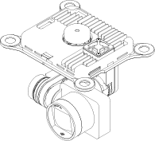
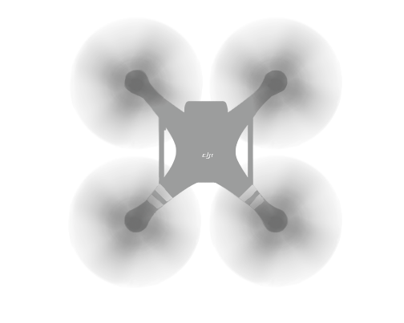
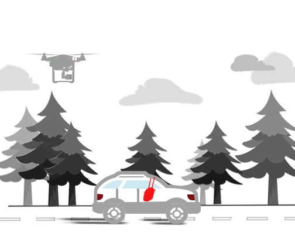
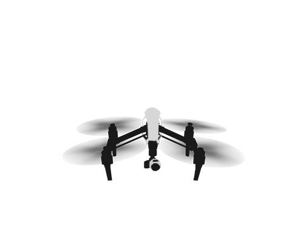

# DJI Mobile SDK Framework Handbook

[English](#purpose-of-handbook) | [中文](#指南目的)

## Purpose of Handbook 

This handbook provides a high level overview of the different components that make up the SDK, so that developers can get a feel for the SDK's structure and its different components. This handbook does not aim to provide specific information that can be found in the SDK. After reading through this handbook, developers should be able to begin working closely with the SDK.

## SDK Structure

### Camera

#### 1. SD Card

DJI drones will save photos and videos captured through the camera to the SD card inserted into the camera. Information about the current state of the SD card can be accessed through the camera interface.

#### 2. Playback State and Manager 

Accessing the media files in the SD card require that you switch the camera into a playback mode. There are several different playback modes, each allowing you to view or manipulate the files differently. The playback manager allows you to switch between playback modes, and carry out actions specific to each mode. Moreover, you can check the playback state like the numbersOfThumbnail, currentSelectedFileIndex, videoDuration, etc.

#### 3. System State

The system state of the camera is monitored through a set of bool values. Is the camera overheating? Is the camera in USB mode? Is it currently taking a single photo, or burst photos? The answers to these and similar questions are found in the camera interface.

#### 4. Camera Parameters

Camera has various parameter ranges for you to adjust (i.e. shutter speed range, ISO range, aperture range). The camera interface allows you to adjust these parameters.

#### 5. Camera Lens State

DJI X5 and X5R camera support adjusting camera lens feature. You can check if lens installed, lens type, focusMode, etc from the camera lens state.

#### 6. Media and Media Manager

Media is a class used to store information about an individual media file in the drone's SD card. It can represents either photo or video. There are various media types like JPEG, MP4, RAWDNG, etc. It contains the necessary parameters, for example fileName, created time and thumbnail. The Media Manager provides functions for you to fetch or delete media list.
 
### Gimbal

The gimbal is the mechanism that keeps the camera steady while the drone moves, absorbing shock from vibrations and sudden movements. The gimbal is also responsible for controlling the direction that the camera is pointing in. The gimbal interface allows you to control and get information about the gimbal.

### Battery

The DJI battery interface includes a set of Smart Battery functions, which can be used to get battery state, warning info and self discharge day. It can ensure whether the battery is healthy to use for flying and has enough battery to return home.

### AirLink

AirLink represents the wireless communication either between the RC(Ground System) and aircraft(Air System), or between the DJI WiFi product(Like Phantom 3 Standard, OSMO) and mobile device.

#### 1. Light Bridge Link

  This is used for DJI Light Bridge 2. It provides a set of functions, which can be used to get and set channel, data transfer rate, FPV video quality latency, FPV video band width, etc. Also, you can set video output format like HDMI, SDI and even set PIP(Picture In Picture) position on the screen. Furthermore, it contains delegate methods to get RC signal info, signal strength, video data, etc.

#### 2. WiFi Link

 This is used for DJI Phantom 3 Standard and OSMO. It provides a set of functions, which can be used to get and set WiFi SSID, password, frequency band. Also you can reboot the WiFi and update the WiFi signal quality too.

### Handheld Controller

The handheld controller can be used to control core functionality of DJI Handheld devices, especially for OSMO. You can modify OSMO's mode like sleep mode, awake mode and even shut down the device.

### Main Controller

The main controller can be used to provide fundamental information about the drone, as well as control core functionality.

#### 1. System State

The main controller's system state gives crucial information about the current state of the drone, which will allow you to determine its velocity, location, as well as when and where to appropriately land the drone.

#### 2. Return To Home

DJI drones contain a 'Return To Home' functionality, which automatically directs the drone back to home, which is traditionally the point from where the drone has taken off. If the GPS signal is not good, the home point will be recorded when the GPS signal is strong enough. The main controller includes functions for configuring and using 'Return To Home'.

### Intelligent Navigation 

Intelligent Navigation provides the ability for developers to control the drone through the use of missions. Each type of mission is designed to navigate the drone in some specific and particular manner, such as following an object or orbiting a fixed point. More information of each type of navigation mission is given in the Concepts to Understand section below.

**Note for Android Developers: There currently does not exist a Navigation package in the Android SDK. Missions can be found in the GroundStation package instead.**

### Image Transmitter

The Image Transmitter is a physical component found in the remote controllers of the Inspire 1 and Phantom 3 series, used to transmit high quality photo and video files. Older drone models require the purchase of a Light Bridge unit to achieve the same capabilities.

### Remote Controller

Controls the interaction between the Remote Controller and the drone.

#### 1. Slave, Master

Remote controllers of the Inspire 1 can be configured to act as a Master or a Slave. Masters control the entire drone, including the gimbal, while Slaves control only the gimbal. Slaves can only issue commands via a Master.

## Concepts to Understand 

### Attitude

Attitude is a vehicle's orientation about its center of mass. You can accurately describe an object's attitude through three characteristics: its pitch, roll and yaw. Controlling both the drone and the gimbal's orientation through the SDK requires that you manipulate these three values:

#### 1. Yaw

The above diagram shows the drone from above. Yaw measures an object's rotation about the vertical axis. Adjusting the yaw will keep the drone horizontal, but change the direction it is facing.

#### 2. Pitch

The above diagram shows the drone from the side. Pitch measures an object's rotation about the lateral axis. Adjusting the pitch will tilt the drone forwards or backwards.

#### 3. Roll

The above diagram shows the drone from behind. Roll measures an object's rotation about the longitudinal axis. Adjusting the roll will tilt the drone left or right.

### Throttle

Throttle controls the drone's velocity in the direction of the vertical axis. While the drone is level, adjusting the throttle will move the drone up or down. However, changing the drone's pitch or roll will tilt its vertical axis, causing the throttle to accelerate the drone at an angle.

### Types of Navigation Missions

Navigation is the umbrella term used to refer to controlling the drone through one of a variety of Navigation Missions.

#### 1. Follow Me Mission

In a follow me mission, the drone is programmed to track and maintain a constant distant relative to some object, such as a person or a moving vehicle. (Inspire 1 is not supported)

#### 2. Hot Point Mission

In a hot point mission, the drone will repeatedly fly circles of a constant radius around a specified point called a Hot Point.

#### 3. IOC (Intelligent Orientation Control) Mission

IOC allows users to lock the orientation of aircraft in different fashions. In other words, the orientation of the drone is irrelevant to the direction it moves in. IOC only works under F mode, and user must toggle the flight mode switch to “F” mode on the RC to activate IOC. 

IOC has two main modes, **Course Lock** and **Home Lock**. 

**Course Lock** allows you to lock the orientation of the drone, while moving the drone relative to an external linear coordinate system.

**Home Lock** moves the drone relative to an external circular coordinate system, with the origin called the Home Point. This means that pushing forward on the remote will move the drone directly away from the Home Point, pushing back will move the drone directly towards it, and pushing left or right will move the drone in a circular path around it.

#### 4. Waypoint Mission

Waypoints are physical locations that the drone will fly to. Creating a series of waypoints, in effect, will program a flight route for the drone to follow. Actions can also be added to waypoints, which will be carried out when the drone reaches the waypoint.

### Joystick/Flight Control

Flight control is a direct, low level method of controlling the drone. Flight control allows you to direct the drone by adjusting its yaw, pitch, roll and throttle.

### Callbacks

#### 1. DJI Errors

Every SDK function you call requires a callback as a parameter, which will be carried out after the drone executes the given command(s). The most common callback takes in a DJIError returned from the drone, which gives simple feedback on the success of the function execution.

#### 2. Other Callbacks

It is appropriate for some functions in the SDK to receive more than a DJIError as feedback after the drone has finished execution. It may also be necessary for additional commands to be sent during different stages of execution. For example, the callback for downloading files from the SD card has methods to be carried out during the start, the end, and on during progress updates of the download process. Appropirately, it takes in an int **progress** as well as the expected DJIError object.

Some callbacks are also called regularly to monitor changes in the drone's state, such as a change in its current battery level.

## Unique Aircraft Capabilities 

### Phanton 3 Professional & Advanced

1. The Phantom 3 Professional supports up to 4K, 30fps video recording, while the Phantom 3 Advanced only supports up to 1080p, 30fps.

2. Supports channel selection and live stream settings, Max Transmission Distance: 2000m.

### Inspire 1

1. The Inspire 1 is unique in that it lifts its landing gears up out of the camera's field of vision during flight, allowing the camera to rotate along the horizontal plane in any direction without capturing the legs. As a result, the Inspire 1's gimbal has been designed to be able to rotate, from its initial front facing orientation, 320 degrees clockwise or anti-clockwise, giving it a 640 degree range of rotation.

2. The Inspire 1 remote controllers have master/slave functionality.
3. The Inspire 1 remote controllers have embedded GPS.
4. The Inspire 1 remote has HDMI output capabilities.

### Matrice 100

The Matrice 100 is the first of our fully flexible developer drones, with fully customizable hardware. The Matrice can be programmed using the Onboard SDK, which allows for direct control of the drone, without having to control it through an external mobile device. Find out more about the Onboard SDK [here](https://developer.dji.com/onboard-sdk/).

## Summary

You should now have a general familiarity of the different components of the SDK, and understand core air flight concepts. Your next step should be to jump in and start developing using the SDK! Good luck!

---

## 指南目的

本指南针对SDK的各种抽象概念进行了解释，方便开发者对SDK的架构和各种概念有一个清晰的理解。 本指南不会提供SDK的详细信息，具体您可以直接在SDK中了解。在阅读完本指南后，开发者可以更容易上手我们的SDK。

## SDK 架构

### 相机

#### 1. SD卡

DJI 飞行器会把拍摄到的照片和视频保存到相机的SD卡中，SD卡的当前状态信息可以在相机接口中获取。

#### 2. 回放 

访问SD卡中的媒体文件需要你把相机切换到回放模式。相机有多种不同的回放模式，每一种模式都可以让你查看或者操作文件。相机接口允许你切换不同的回放模式，并且调用针对特定模式的`action`方法。

#### 3. 系统状态

相机的系统状态通过使用一系列的布尔值记录状态。相机过热？相机是否连接到PC上面了？是否在进行单张拍照，或者定时拍？相关答案或者问题，你都可以在相机接口中找到。

#### 4. 相机设置

DJI 飞行器的相机有大量的参数可以去设置 (如快门速度，ISO，光圈)。 相机接口允许你去设置这些参数。

### 电池

#### 1. 智能电池

DJI SDK的电池接口提供了访问智能电池状态的函数, 可用于确保飞行器有足够的电量返航。 
 
### 云台

云台是可以在飞行器移动，震动或者突然晃动的情况下，确保相机稳定的机械装置。云台还可用于控制相机的朝向。云台接口允许你去控制和获取云台的状态信息。
	
### 主控制器

主控制器用于提供飞行器基本信息，也包括核心的控制功能。

#### 1. 系统状态

主控制器的系统状态提供了飞行器当前状态的关键信息, 这些信息可以让你判断它的当前速度，位置，以及何时何地可以恰当地降落。

#### 2. 返航

DJI 飞行器有一个 "返航" 功能, 可以自动将飞行器控制回到Home点, 该Home点就是飞行器起飞的点，如果起飞的时候GPS信号不好，会等到搜索到GPS信号的时候才记录home点。主控制器包含可以配置和使用“返航“功能的函数。

### 智能飞行(Intelligent Navigation)

智能飞行可以让开发者使用"任务"来控制飞行器进行智能飞行。 每一种"任务"的设计是用来导航飞行器进行某种特定的行为动作，例如跟随物体或者环绕某个点飞行。更多关于智能飞行任务的信息，可以参考“重要概念”部分内容。

**注意: 对于Android开发者, 目前Android SDK中还不存在一个Navigation包。任务可以在GroundStation包中找到。**

### 高清图传

高清图传 是一个Inspire 1 和 Phantom 3系列机型遥控器中的部件，用于传输高清照片和视频文件。

### 遥控器

用于控制飞行器。

#### 1. 主机与从机

Inspire 1的遥控器可以配置为主机或者从机。主机可以控制整台飞行器，包括云台，然而从机只能控制云台。从机只能通过主机来发送命令。

### DJIMedia

这个类用于保存飞行器SD卡中单独的媒体文件信息。目前适用于Phantom 2系列，Phantom 3 Professional, Phantom 3 Advanced 和 Inspire 1 机型。

## 重要概念

### 姿态

姿态是一个机械物体重心的方向值。你可以用三个参数来描述一个物体的姿态: 它的pitch, roll 和 yaw。 要想用SDK来控制飞行器和云台的方向，需要你处理这三个值:

#### 1. Yaw

上图是飞行器的顶部。Yaw测量了物体绕着垂直轴旋转的值。调整Yaw参数值会改变它的朝向，但飞行器会保持水平。

#### 2. Pitch

上图是飞行器的侧面。Pitch测量了物体绕着侧面轴旋转的值。调整Pitch参数值会使飞行器向前或者向后倾斜。

#### 3. Roll

上图是飞行器的背面。Roll测量了物体绕着纵向轴旋转的值。调整Roll参数值会让飞行器向左或者向右倾斜。

### Throttle

Throttle 控制了飞行器在垂直轴方向上的运动速度。当飞行器水平时，调整throttle值可以让飞行器上升或者下降。然而，改变飞行器的pitch或者roll值会使它的垂直轴倾斜，这样，throttle值会让飞行器在一定角度上加速运动。

### 智能飞行任务的类型

智能飞行包括多种任务。

#### 1. 跟随任务

在跟随任务中，飞行器会自动追踪物体（如人或者运动的机器），并保持一定的距离飞行。暂不支持Inspire 1机型。

#### 2. 热点环绕任务

在热点环绕任务中，飞行器会以一定半径绕着一个叫做“热点”的中心点飞行。

#### 3. 智能航向锁定任务

IOC 智能航向控制功能可帮助用户更方便地控制飞行器航向。换个说法，飞行器的机头朝向和它移动的方向无关。用户在F模式下才可使用IOC智能航向控制功能,需要在遥控器上切换飞行模式为F模式。

IOC 有两种模式, **航向锁定** 和 **返航锁定**. 

**航向锁定** 允许你锁定飞行器的航向，以飞行器进入IOC模式时的机头方向为前进方向，推杆向左或者向右，飞机沿与前进方向垂直的方向移动。 飞行器在飞行过程中，机头方向与航向无关，您无需关注机头方向即可简单控制飞行器飞行。

**返航锁定** 该模式下，飞行器会在圆坐标系下运动，中心点为Home点。如果遥控器推杆向前，飞行器会飞离Home点；推杆向后，会朝中心点返回；推杆向左或者向右，飞行器会绕着中心点飞行。

#### 4. 航点任务

航点是飞行器将要飞过去的地理位置。创建一系列航点，可以为飞行器规划飞行航线。另外，航点上也可以添加相应的动作，当飞行器到达该航点时，会执行预先设定好的动作。

### 飞行控制

飞行控制可以从底层直接控制飞行器。它允许你通过调整飞行器的的yaw，pitch, roll和throttle值来控制飞行器飞行。

### 回调

#### 1. DJIError

每一个SDK函数的调用都需要一个回调作为参数，该回调会在飞行器执行完相应的命名后触发。常见的回调中会包含DJIError参数，你可以从中获得相应函数执行的结果信息。

#### 2. 其它回调参数

在飞行器执行完命令后，SDK中的有些函数会接收到除DJIError以外的回调参数。有时候这些额外的回调参数甚至是必须的。例如，从SD 卡下载文件时，回调参数中还会有下载的文件名，文件大小等参数。

一些回调也会被频繁调用，用于监测飞行器的状态信息，例如当前电池电量的改变。

## 独特的飞行器性能 

### Phanton 3 Professional & Advanced

1. Phantom 3 Professional支持4K，30fps的视频录制，而Phantom 3 Advanced只支持1080p, 30fps的视频录制.

2. 支持图传信道选择和视频直播功能，最大图传距离：2000m。

### Inspire 1

1. Inspire 1可以变形将脚架收起，在飞行过程中，相机可以自由旋转拍摄，而不会被脚架挡住视线。所以，Inspire 1的云台被设计成可以支持水平旋转，从初始朝向开始，顺时针或者逆时针旋转320度，达到640度的旋转范围。

2. Inspire 1 遥控器有主从机功能。

3. Inspire 1 遥控器内置GPS功能。

4. Inspire 1 遥控器有HDMI视频输出功能。

### Matrice 100

Matrice 100 是第一款面向开发者的飞行器，配备完全开放自主定制的硬件。Matrice 100可以用Onboard SDK来编程，让你对飞行器拥有控制权，而不需要使用额外的移动设备来控制它。想了解更多关于Onboard SDK的信息，可以看[这里](https://developer.dji.com/onboard-sdk/)。

## 总结

现在你对SDK的不同部分有一个整体的了解，并且理解了核心的飞行概念。接下来就可以开始使用SDK进行开发了！

你可以从这里查看Mobile SDK的API文档：

[iOS Documentation](http://developer.dji.com/mobile-sdk/documentation)

[Android Documentation](http://developer.dji.com/mobile-sdk/documentation/android)

